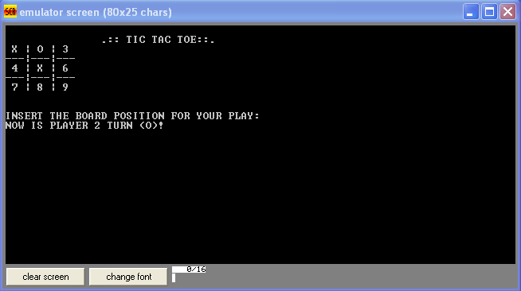

# tictactoe8086

  
  
Meh!

 

## First things first
You must have [emu8086](http://www.emu8086.com/) installed.

## What a mess!
I admit it: this won't be the prettiest code you'll see. I did it for college, so give me a break. **But** if you're not familiarized with`8086 instruction set`, here's a nice [guide](http://www.electronics.dit.ie/staff/tscarff/8086_instruction_set/8086_instruction_set.html). And, if you like a little bit of history, this [book](https://github.com/gurugio/book_assembly_8086) is very cool.

## Compiling
To compile it, you don't even need to understand assembly. Just open `main.asm`  using `emu8086` and click in that nice button called "compile". After that, you just need to wait a little bit and a window will pop up. Choose any directory you want to save the compiled file and then click "run".

That's it!

## License
Released under the [GPLv3](LICENSE) license.
